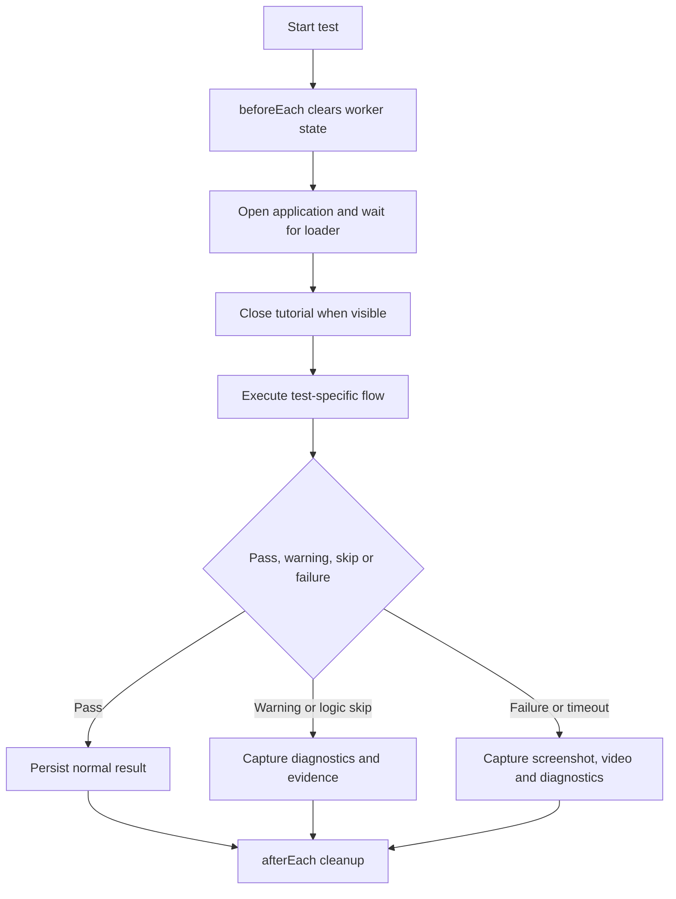
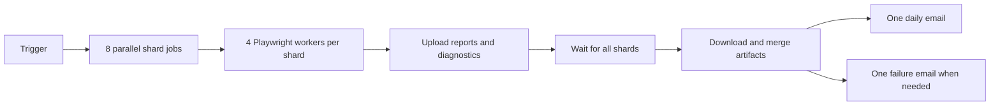

# GeoWGS84 Datastore E2E Test Suite

Playwright end-to-end automation for the GeoWGS84 Datastore application.

## Current Coverage

The current Playwright discovery result is **68 tests in 5 spec files**. All discovered tests are marked P0 in the source.

| Spec file | Tests | Coverage |
| --- | ---: | --- |
| `specs/cart.spec.js` | 3 | Cart, checkout, form submission, export options |
| `specs/launch.spec.js` | 1 | Application launch and tutorial smoke test |
| `specs/map.spec.js` | 10 | Search, location, uploads, coordinates, map and AOI controls |
| `specs/satellite.spec.js` | 43 | Satellite products, scenes, outlines, previews and metadata |
| `specs/service.spec.js` | 11 | Satellite, aerial, lidar, DEM, drone and 3D service flows |
| **Total** | **68** | **All discovered tests** |

The source files and `npx playwright test --list` are the source of truth for the test count. This README documents the implemented flow families and shared logic; it does not replace individual test definitions.

## Test Inventory

### Launch

| Test | Flow |
| --- | --- |
| P0 1 | Open Datastore, verify the shell, map, filters, steps and navigation, validate `/getPartners`, and close the tutorial |

### Cart and Checkout

| Test | Flow |
| --- | --- |
| P0 1 | Search Indore, draw AOI, open imagery, add a scene, open cart, verify product/price/resolution/date columns, and reopen checkout |
| P0 2 | Add imagery, open cart, checkout, download AOI KML, fill the customer form, submit the request, and verify the Thank You page |
| P0 3 | Add imagery, choose UTM, WGS84 and GeoTIFF, verify export selections, checkout, download AOI KML, and verify the Thank You page |

### Map and AOI

| Test | Flow |
| --- | --- |
| P0 1 | Search a valid Indore location, validate Google autocomplete response and selected marker |
| P0 2 | Grant geolocation, simulate Locate Me, verify the browser alert and confirm the map remains usable |
| P0 3 | Upload `MadhyaPradesh.kmz`, verify the active map area, Core Services and information window |
| P0 4 | Open Enter Coordinates, submit latitude/longitude, verify map navigation and marker |
| P0 5 | Open and close the User Guide tutorial popup |
| P0 6 | Draw rectangle AOI, compare World View and AOI View, verify Reset and the restored AOI |
| P0 7 | Exercise Hand, Circle, Polygon and Rectangle AOI drawing and service popups |
| P0 8 | Verify zoom, pan direction controls and map visibility |
| P0 9 | Toggle Map and Satellite views, validate the satellite API and visual change |
| P0 10 | Submit an invalid search value and verify validation without changing the map |

### Satellite Products

The satellite suite contains 43 product tests. The common helper is used for the standard product flow; the second and third helpers handle product-specific scene and metadata variations.

| Test | Product |
| ---: | --- |
| 1 | WorldView02 |
| 2 | WorldView03 |
| 3 | WorldView04 |
| 4 | WorldView01 |
| 5 | WV-Legion01 |
| 6 | WV-Legion02 |
| 7 | GeoEye1 |
| 8 | QuickBird |
| 9 | IKONOS |
| 10 | 21AT 30cm Archive |
| 11 | 21AT 80cm Archive |
| 12 | OSE-GF01(0.5m) |
| 13 | JL1KF01B(0.5m) |
| 14 | JL1KF01C(0.5m) |
| 15 | JL1KF02B01(0.5m) |
| 16 | JL1KF02B02(0.5m) |
| 17 | JL1KF02B03(0.5m) |
| 18 | JL1KF02B07(0.5m) |
| 19 | 21AT Tasking |
| 20 | Satellogic |
| 21 | EOS SAT-1 1.5m Archive |
| 22 | EOS SAT-1 1.5m Tasking |
| 23 | Kompsat-2 |
| 24 | Kompsat-3 |
| 25 | Kompsat-3a |
| 26 | 21AT 50cm Archive |
| 27 | OSE-GF01(0.5m) |
| 28 | OSE-HS01(5m) |
| 29 | OSE-HS02(5m) |
| 30 | BJ3A(0.5m) |
| 31 | BJ2(0.8m) |
| 32 | SV-2(0.5m) |
| 33 | SV1A(0.5m) |
| 34 | SV1B(0.5m) |
| 35 | SV1C(0.5m) |
| 36 | SV1D(0.5m) |
| 37 | SVN3-01(0.5m) |
| 38 | SVN3-02(0.5m) |
| 39 | JL1KF02A(0.5m) |
| 40 | JL1KF02B04(0.5m) |
| 41 | JL1KF02B05(0.5m) |
| 42 | JL1KF02B06(0.5m) |
| 43 | LJ3II(0.5m) |

Every satellite product flow covers, when applicable:

1. Open the application, close the tutorial and wait for the map.
2. Search Denver and verify autocomplete, map movement and marker.
3. Open Map Camera Control, zoom, open AOI Draw and create the required AOI.
4. Verify the service grid and select Satellite.
5. Remove existing satellite filters before adding the requested product.
6. Search imagery and wait for the scenes table.
7. Verify scene rows and activate Outline.
8. Activate Preview and validate a real imagery URL, not a marker or icon image.
9. Open Metadata, validate the metadata image and Details table, then close it.
10. Cancel the row and verify the scene overlay is removed.

## Shared Flow and Conditions



Common conditions handled by the suite:

- Loader and tutorial may already be hidden; close operations are conditional.
- Map controls can be covered or delayed; `robustClick` retries before failing.
- Google autocomplete and imagery APIs are validated by status and response shape.
- AOI tools are reached by zooming until the draw controls become available.
- Existing satellite filters are removed before a product is selected.
- Empty imagery results are treated as a documented logic skip, not a browser crash.
- Missing optional outline or preview controls are recorded as warnings where the flow can continue; required map, table, modal and submission states fail.
- Metadata image loading retries the popup after transient server failures.
- Preview detection rejects empty, data, Google, marker, icon and placeholder URLs.
- Satellite scene IDs support standard IDs, dash-separated IDs and underscore IDs.
- Test retries are enabled only in CI: two retries after the initial attempt.

## Runtime Architecture

```text
specs/*.spec.js
    -> specs/common.js beforeEach / afterEach
    -> pages/ page objects
    -> utils/helpers.js and satellite helpers
    -> diagnostics/, test-results/
    -> blob reports
    -> one email-report aggregation job
```

Important directories:

```text
playwright.config.js       Playwright settings and reporters
specs/                     68 test definitions and shared hooks
pages/                     Page object models
utils/                     Assertions, waits, diagnostics and satellite flows
reporters/                 Consolidated HTML email reporter
test-data/                 KML/KMZ files and email assets
diagnostics/               Runtime JSON diagnostics
test-results/              Screenshots, videos and traces
blob-report/               Per-shard Playwright merge input
```

## Diagnostics

`specs/common.js` clears per-test state in `beforeEach` and records the result in `afterEach`. Diagnostics can include:

- Test status, duration, URL and current step.
- INFO messages, warnings, errors and logic-skipped steps.
- Browser console and page errors.
- Failed network requests, excluding explicitly ignored telemetry and download cases.
- Screenshots, videos and other test attachments.

Diagnostics are worker-local during execution. The CI email job downloads diagnostic artifacts from all shards before building the consolidated report. Missing diagnostics for a passing test are not themselves a test failure; the Playwright blob report remains the authoritative result source.

## Email Reporting

Shard jobs do not send mail. After all eight shards complete, the single `email-report` job downloads the artifacts and runs `npm run report:email`.

- **Daily email:** one summary for all 68 tests with pass, fail, warning, logic-skip and skipped totals.
- **Failure email:** one detailed email only when failures remain after CI retries. It includes the consolidated test table, logs and available evidence from all shards.
- There is never one email per shard.

Configure these GitHub Actions secrets:

```text
DAILY_REPORT_EMAILS
FAILURE_ALERT_EMAILS
SMTP_HOST
SMTP_PORT
SMTP_SECURE
SMTP_USER
SMTP_PASS
SMTP_FROM
```

For Gmail, use an app password or another supported SMTP credential. A normal account password commonly causes SMTP `535 Username and Password not accepted`. Keep credentials in GitHub Secrets, never in a committed `.env` file.

## CI/CD

The scheduled workflow runs at `06:30 UTC` (`12:00 IST`) and can also run on pushes to `main`, pull requests targeting `main`, or manual dispatch.



Current CI settings:

| Setting | CI value |
| --- | --- |
| Runner | Ubuntu 24.04 |
| Node.js | 22 |
| Shards | 8 |
| Workers per shard | 4 |
| Maximum test workers | 32 |
| Playwright retries | 2 |
| Shard timeout | 60 minutes |
| Artifact retention | 7 days |
| Browser | Chromium, headless |

## Configuration

| Variable | Default | Purpose |
| --- | --- | --- |
| `BASE_URL` | `https://datastore.geowgs84.com` | Application URL |
| `HEADLESS` | `false` locally, `true` in CI | Browser mode |
| `PW_WORKERS` | `6` locally, `4` in CI | Workers per process |
| `PW_SLOWMO` | `250` locally, `0` in CI | Browser action delay |
| `PAUSE_MULTIPLIER` | `1.5` | Visual pause multiplier |
| `SOFT_ASSERT` | `false` | Convert selected assertions to warnings |
| `DEFAULT_WAIT` | `15000` | Default wait in milliseconds |
| `OUTLINE_WAIT_MS` | `90000` | Outline wait |
| `PREVIEW_WAIT_MS` | `90000` | Preview wait |
| `DETAILS_IMAGE_WAIT_MS` | `120000` | Metadata image wait |
| `REPORT_TIMEZONE` | `Asia/Kolkata` | Email timestamps |
| `ENABLE_EMAIL_REPORTER` | `false` | Optional local email reporter |

## Useful Commands

```bash
npm ci
npx playwright test --list --project=chromium
npx playwright test --project=chromium
npx playwright test -g "\[P0\]" --project=chromium --workers=1
npx playwright test specs/satellite.spec.js -g "worldview01" --project=chromium
npx playwright show-report
npm run report:email
npm audit --audit-level=moderate
```

Disable local email explicitly when needed:

```bash
ENABLE_EMAIL_REPORTER=false npx playwright test --project=chromium
```

## Source of Truth

When this README and the implementation differ, verify in this order:

1. `npx playwright test --list --project=chromium` for the test count.
2. `playwright.config.js` for execution, retry and reporter behavior.
3. `.github/workflows/playwright.yml` for CI shards, workers and email ordering.
4. The spec and helper files for individual testcase logic and conditions.
