# 🧪 GeoWGS84 Datastore — E2E Test Suite

<p align="center">
  
  
    
    
  
  
  
</p>

<p align="center">
  
  
  
</p>

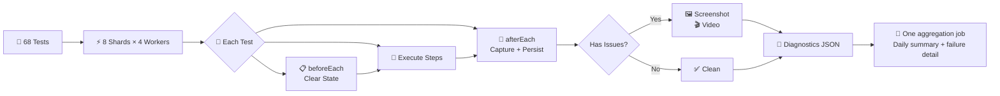

---

## 📑 Table of Contents

- [Architecture Overview](#-architecture-overview)
- [Project Structure](#-project-structure)
- [Page Object Model](#-page-object-model)
- [Current Test Inventory](#-current-test-inventory)
- [Representative Flow Diagrams](#-representative-flow-diagrams)
- [Diagnostics System](#-diagnostics-system)
- [Email Reporting](#-email-reporting)
- [CI/CD Pipeline](#-cicd-pipeline)
- [Configuration Reference](#-configuration-reference)
- [Troubleshooting](#-troubleshooting)

---

## 🏗️ Architecture Overview

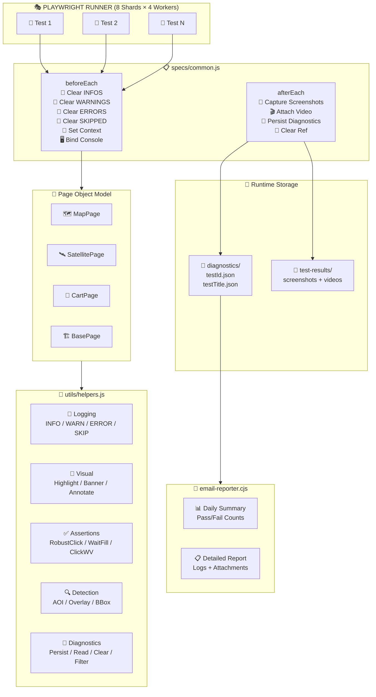

---

## 🧪 Current Test Inventory

The repository currently contains **68 Playwright tests**. Playwright runs them
with `fullyParallel: true`, across eight balanced CI shards with four workers
per shard:

| Spec file | Tests | Coverage |
|-----------|------:|----------|
| `specs/cart.spec.js` | 3 | Cart, checkout, export options |
| `specs/launch.spec.js` | 1 | Application launch smoke test |
| `specs/map.spec.js` | 10 | Search, map controls, AOI, uploads, navigation |
| `specs/satellite.spec.js` | 43 | Satellite products, scenes, previews, metadata |
| `specs/service.spec.js` | 11 | Service filters, workflows, and checkout |
| **Total** | **68** | **All discovered tests** |

The source files and Playwright's `--list` output are the source of truth for
test count. The flow diagrams below document representative workflows and are
not a numbered replacement for every individual test definition.

## 📁 Project Structure

```
Geowgs84-Datastore/
├── ⚙️ playwright.config.js              ← Workers, reporters, timeouts
├── 🔄 .github/workflows/playwright.yml ← Daily CI @ 12:00 IST
│
├── 📂 specs/
│   ├── 📄 common.js                    ← beforeEach / afterEach hooks
│   ├── 📄 map.spec.js                   ← Map and AOI tests
│   ├── 📄 satellite.spec.js             ← Satellite service tests
│   ├── 📄 cart.spec.js                  ← Cart and checkout tests
│   ├── 📄 service.spec.js               ← Service workflow tests
│   └── 📄 launch.spec.js                ← Launch smoke test
│
├── 📂 pages/
│   ├── 📄 BasePage.js                  ← Shared: highlight, click, wait
│   ├── 📄 MapPage.js                   ← Map: search, AOI, coords, hover
│   ├── 📄 SatellitePage.js             ← Satellite: products, scenes, images
│   └── 📄 CartPage.js                  ← Cart: add, verify, checkout
│
├── 📂 utils/
│   ├── 📄 helpers.js                   ← All utilities + diagnostics engine
│   └── 📂 test-data/
│       ├── 🖼️ Datastore_Logo.png       ← Email logo (inline CID)
│       └── 🗺️ MadhyaPradesh.kmz        ← Test upload file
│
├── 📂 reporters/
│   └── 📄 email-reporter.cjs            ← HTML email with animations
│
├── 📂 diagnostics/                     ← Runtime JSON files (auto-managed)
├── 📂 test-results/                    ← Screenshots + Videos
└── 📂 playwright-report/               ← HTML report
```

---

## 🎭 Page Object Model

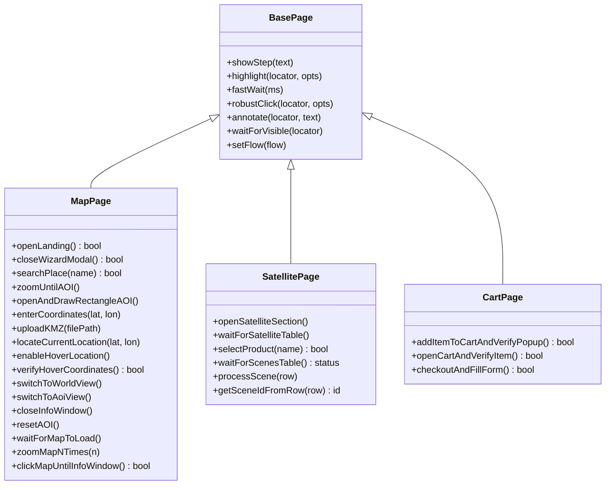

---

## 🧭 Representative Flow Diagrams

### Test 1: Shopping Cart & Checkout

```mermaid
flowchart TD
    START([🟢 START]) --> S1
    S1["🌐 Step 1<br/>openLanding()"] --> S1C{URL contains<br/>datastore?}
    S1C -->|No| S1F[⚠️ Warning +Screenshot]
    S1C -->|Yes| S2

    S2["❌ Step 2<br/>closeWizardModal()"] --> S2C{Modal<br/>visible?}
    S2C -->|No| S2S[⏭️ SKIPPED<br/>Already closed]
    S2C -->|Yes| S2D[Click close button]
    S2D --> S2H{Modal<br/>hidden?}
    S2H -->|No| S2F2[⚠️ Warning<br/>Force click]
    S2H -->|Yes| S3
    S2F2 --> S3
    S2S --> S3

    S3["🔍 Step 3<br/>searchPlace 'Indore'"] --> S3A[Click search icon]
    S3A --> S3B{pac-input<br/>visible?}
    S3B -->|No| S3F[⚠️ Warning]
    S3B -->|Yes| S3C[Type 'Indore']
    S3C --> S3D{Suggestion<br/>visible?}
    S3D -->|No| S3F
    S3D -->|Yes| S3E[Click suggestion]
    S3E --> S3G{AOI toolbar<br/>visible?}
    S3G -->|No| S3H2[Zoom + retry]
    S3H2 --> S3G
    S3G -->|Yes| S3I[Draw rectangle]
    S3I --> S3J{AOI detected?}
    S3J -->|No| S3F2[⚠️ Warning +Screenshot]
    S3J -->|Yes| S4
    S3F --> END_FAIL
    S3F2 --> S4

    S4["🛰️ Step 4<br/>openSatelliteSection()"] --> S4C{Product table<br/>visible 60s?}
    S4C -->|No| S4F[❌ Throw error]
    S4C -->|Yes| S5

    S5["⏳ Step 5<br/>waitForSatelliteTable()"] --> S5C{Table loaded?}
    S5C -->|No| S5F[❌ Throw error]
    S5C -->|Yes| S6

    S6["🛒 Step 6<br/>addItemToCartAndVerifyPopup()"] --> S6A[Extract product name]
    S6A --> S6B{First row<br/>visible?}
    S6B -->|No| S6F[⚠️ Warning +Screenshot]
    S6B -->|Yes| S6C[Click add-to-cart btn]
    S6C --> S6D{Popup visible<br/>15s?}
    S6D -->|No| S6F2[⚠️ Warning +Screenshot]
    S6D -->|Yes| S6E{Contains<br/>'Item added'?}
    S6E -->|No| S6F3[⚠️ Warning]
    S6E -->|Yes| S6G{display:block?}
    S6G -->|No| S6F4[⚠️ Warning +Screenshot]
    S6G -->|Yes| S7
    S6F --> END_FAIL
    S6F2 --> S7
    S6F3 --> S7
    S6F4 --> S7

    S7["🛒 Step 7<br/>openCartAndVerifyItem()"] --> S7A{Badge text<br/>== '1'?}
    S7A -->|No| S7F[⚠️ Warning +Screenshot]
    S7A -->|Yes| S7B[Click cart trigger]
    S7B --> S7C{Cart table<br/>visible 15s?}
    S7C -->|No| S7F2[⚠️ Warning +Screenshot]
    S7C -->|Yes| S7D{First row<br/>matches product?}
    S7D -->|No| S7F3[⚠️ Warning +Screenshot]
    S7D -->|Yes| S8
    S7F --> END_FAIL
    S7F2 --> S8
    S7F3 --> S8

    S8["🛒 Step 8<br/>checkoutAndFillForm()"] --> S8A{Checkout btn<br/>visible?}
    S8A -->|No| S8F[⚠️ Warning +Screenshot]
    S8A -->|Yes| S8B[Click checkout]
    S8B --> S8C{Form fields<br/>visible 15s?}
    S8C -->|No| S8F2[⚠️ Warning +Screenshot]
    S8C -->|Yes| S8D[Fill 11 fields]
    S8D --> S8E[Click submit]
    S8E --> S8G{New tab OR<br/>navigation?}
    S8G -->|No| S8F3[⚠️ Warning +Screenshot]
    S8G -->|Yes| S8H{URL contains<br/>thank_you?}
    S8H -->|No| S8F4[⚠️ Warning +Screenshot]
    S8H -->|Yes| END_PASS

    S8F --> END_FAIL
    S8F2 --> END_FAIL
    S8F3 --> END_FAIL
    S8F4 --> END_FAIL

    END_PASS([✅ PASSED])
    END_FAIL([❌ FAILED / ⚠️ WARNINGS])

    style START fill:#22c55e,color:#fff
    style END_PASS fill:#22c55e,color:#fff
    style END_FAIL fill:#dc2626,color:#fff
    style S1F fill:#fef2f2,color:#dc2626
    style S2F2 fill:#fef2f2,color:#dc2626
    style S3F fill:#fef2f2,color:#dc2626
    style S3F2 fill:#fef2f2,color:#dc2626
    style S4F fill:#dc2626,color:#fff
    style S5F fill:#dc2626,color:#fff
    style S6F fill:#fef2f2,color:#dc2626
    style S6F2 fill:#fef2f2,color:#dc2626
    style S6F3 fill:#fef2f2,color:#dc2626
    style S6F4 fill:#fef2f2,color:#dc2626
    style S7F fill:#fef2f2,color:#dc2626
    style S7F2 fill:#fef2f2,color:#dc2626
    style S7F3 fill:#fef2f2,color:#dc2626
    style S8F fill:#fef2f2,color:#dc2626
    style S8F2 fill:#fef2f2,color:#dc2626
    style S8F3 fill:#fef2f2,color:#dc2626
    style S8F4 fill:#fef2f2,color:#dc2626
    style S2S fill:#f5f3ff,color:#7c3aed
```

**Product Name Extraction:**

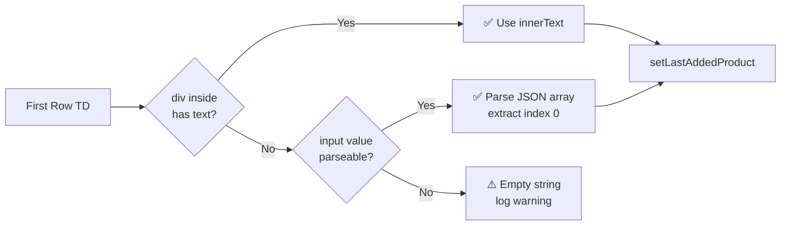

---

### Tests 2–13: Satellite Scene Processing

All 12 satellite tests share this outer flow, then branch into the scene processing pipeline:

```mermaid
flowchart TD
    START([🟢 START]) --> S1
    S1["🌐 Open Landing"] --> S2
    S2["❌ Close Wizard"] --> S3
    S3["🔍 Search 'Indore' + Draw AOI"] --> S4
    S4["🛰️ Open Satellite Section"] --> S5
    S5["⏳ Wait Product Table 60s"] --> S5C{Table<br/>visible?}
    S5C -->|No| FAIL1[❌ Throw]
    S5C -->|Yes| S6

    S6["🔍 Select Product"] --> S6C{Product cell<br/>found?}
    S6C -->|No| S6S["⏭️ markLogicSkipped<br/>Product not found"]
    S6C -->|Yes| S6D[Click product cell]
    S6S --> END_SKIP([⏭️ PASS + SKIPPED])
    S6D --> S7

    S7["⏳ Wait Scenes Table 180s"] --> S7P[Poll loop<br/>every 3s]
    S7P --> S7A{Processing<br/>indicator?}
    S7A -->|Yes| S7P
    S7A -->|No| S7B{Rows > 0<br/>and not empty?}
    S7B -->|Yes| PROC
    S7B -->|No| S7C{180s<br/>elapsed?}
    S7C -->|No| S7P
    S7C -->|Yes| S7D{Last-moment<br/>rows found?}
    S7D -->|Yes| PROC
    S7D -->|No| EMPTY["⏭️ markLogicSkipped<br/>No scenes for AOI"]
    EMPTY --> END_EMPTY([⏭️ PASS + EMPTY])

    PROC["🎬 processScene(firstRow)"] --> SCENE_PIPE

    subgraph SCENE_PIPE ["Scene Processing Pipeline"]
        direction TB
        O1["1️⃣ OUTLINE"] --> O1A{Outline btn<br/>found?}
        O1A -->|No| O1S[⏭️ Skipped]
        O1A -->|Yes| O1B{State =<br/>'Show'?}
        O1B -->|Yes| O1C[Click to activate]
        O1B -->|No| O1D[Already active]
        O1C --> P1
        O1D --> P1
        O1S --> P1

        P1["2️⃣ PREVIEW"] --> P1A[Click preview btn]
        P1A --> P1B[Capture existing<br/>map img srcs]
        P1B --> P1C["Strategy 1:<br/>Wait new img src"]
        P1C --> P1D{New valid<br/>image?}
        P1D -->|Yes| P1OK[✅ Preview found]
        P1D -->|No| P1E["Strategy 2:<br/>Find by sceneId"]
        P1E --> P1F{Found by<br/>sceneId?}
        P1F -->|Yes| P1OK
        P1F -->|No| P1G["Strategy 3:<br/>Find browse URL"]
        P1G --> P1H{Browse<br/>found?}
        P1H -->|Yes| P1OK
        P1H -->|No| P1FAIL[⚠️ No valid preview]
        P1OK --> D1
        P1FAIL --> D1

        D1["3️⃣ DETAILS"] --> D1A[Click details btn]
        D1A --> D1B{Modal<br/>visible 25s?}
        D1B -->|No| D1F[⚠️ Modal error]
        D1B -->|Yes| D1C[Wait #img_scene<br/>up to 120s]
        D1C --> D1D{Detail src<br/>valid?}
        D1D -->|No| D1F2[⚠️ Invalid src]
        D1D -->|Yes| D1E{Preview vs Detail<br/>match?}
        D1E -->|Exact match| D1OK["✅ Filenames match"]
        D1E -->|SceneId match| D1OK2["✅ SceneId match"]
        D1E -->|Different| D1INFO["ℹ️ Normal (different views)"]
        D1OK --> D1CLOSE
        D1OK2 --> D1CLOSE
        D1INFO --> D1CLOSE
        D1F --> D1CLOSE
        D1F2 --> D1CLOSE
        D1CLOSE[Close modal] --> END_SCENE
        END_SCENE([Scene Complete])
    end

    style START fill:#22c55e,color:#fff
    style END_SKIP fill:#f5f3ff,color:#7c3aed
    style END_EMPTY fill:#fffbeb,color:#d97706
    style FAIL1 fill:#dc2626,color:#fff
    style P1OK fill:#f0fdf4,color:#16a34a
    style P1FAIL fill:#fef2f2,color:#dc2626
    style D1OK fill:#f0fdf4,color:#16a34a
    style D1OK2 fill:#f0fdf4,color:#16a34a
    style D1INFO fill:#f0f9ff,color:#2563eb
    style D1F fill:#fef2f2,color:#dc2626
    style D1F2 fill:#fef2f2,color:#dc2626
    style O1S fill:#f5f3ff,color:#7c3aed
```

**Preview Image — 3-Strategy Fallback:**

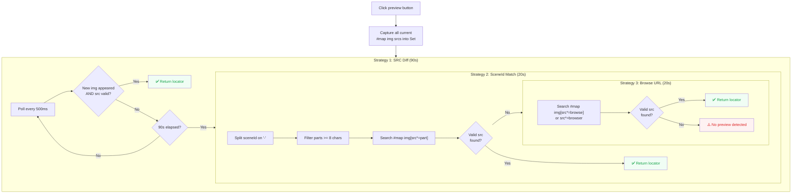

**Image Src Validation Rules:**

```mermaid
flowchart LR
    SRC[Image src] --> R1{Empty / null / undefined?}
    R1 -->|Yes| REJECT❌
    R1 -->|No| R2{Starts with<br/>data: ?}
    R2 -->|Yes| REJECT❌
    R2 -->|No| R3{Contains<br/>google/gstatic?}
    R3 -->|Yes| REJECT❌
    R3 -->|No| R4{Contains<br/>marker/icon/pin?}
    R4 -->|Yes| REJECT❌
    R4 -->|No| R5{Contains<br/>show/hide/preview.png?}
    R5 -->|Yes| REJECT❌
    R5 -->|No| R6{Starts with<br/>http or / ?}
    R6 -->|No| REJECT❌
    R6 -->|Yes| ACCEPT✅

    style REJECT❌ fill:#fef2f2,color:#dc2626
    style ACCEPT✅ fill:#f0fdf4,color:#16a34a
```

**Scene ID Extraction from Row:**

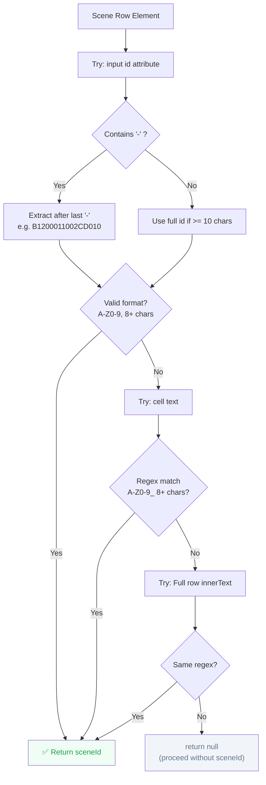

**Preview vs Detail Comparison (Dashed SceneId Handling):**

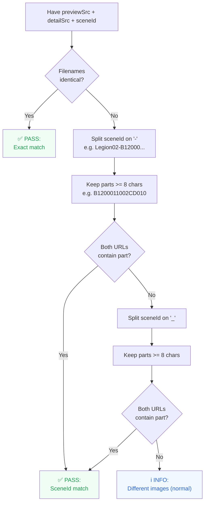

**Scenes Table Polling State Machine:**

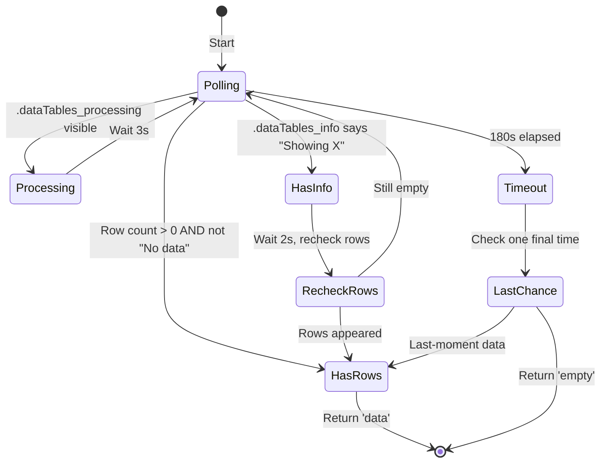

**Products Tested:**

| Test | Product | Scene ID Format | Special |
|------|---------|-----------------|---------|
| 2 | WorldView01 | Standard | — |
| 2.1 | WorldView02 | Standard | — |
| 2.2 | WorldView03 | Standard | — |
| 2.3 | WorldView04 | Standard | — |
| 2.4 | GeoEye1 | Standard | — |
| 2.5 | QuickBird | Standard | — |
| 2.6 | IKONOS | Standard | — |
| 2.7 | 21AT 30cm | `BJ3N3_PMS_20230609...` | Underscore segments |
| 2.8 | 21AT 50cm | `BJ3A1_PMS1_20260314...` | Underscore segments |
| 2.9 | 21AT 80cm | `TRIPLESAT_3_PMS_...` | Underscore segments |
| 2.10 | WV-Legion01 | `Legion01-B1100011002CD010` | 🔑 Dash-split |
| 2.11 | WV-Legion02 | `Legion02-B12000110165F700` | 🔑 Dash-split |

---

### Test 14: Search UI

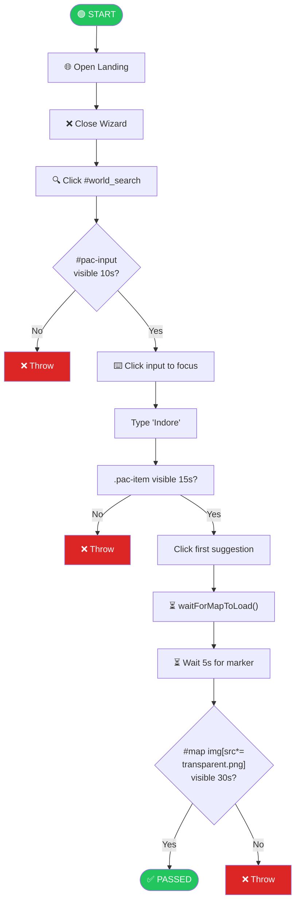

---

### Test 15: Coordinates

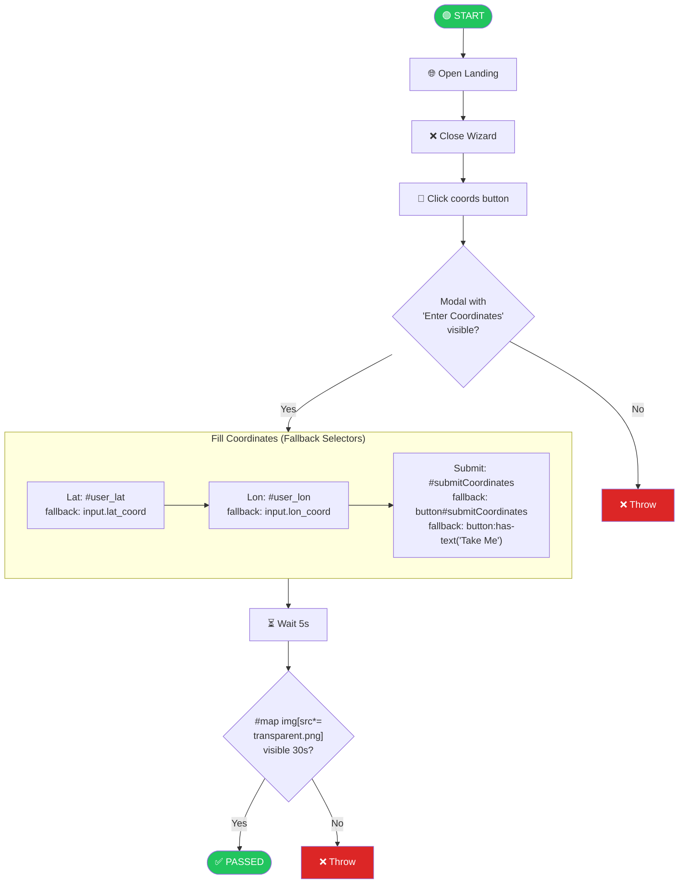

---

### Test 16: Upload KMZ

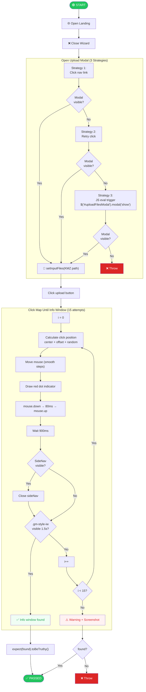

**Click Grid Pattern:**

```
              offset (-120, 0)
                    │
     (-100,-60) ── CENTER ── (100,-60)
          │           │           │
     (-40, 0)      [CLICK]     (40, 0)
          │           │           │
     (-100, 60) ────────── (100, 60)
                    │
              offset (120, 0)

     + Random: 6 additional random points
     + Range: 30-70% of map width/height
```

---

### Test 17: Locate Geolocation

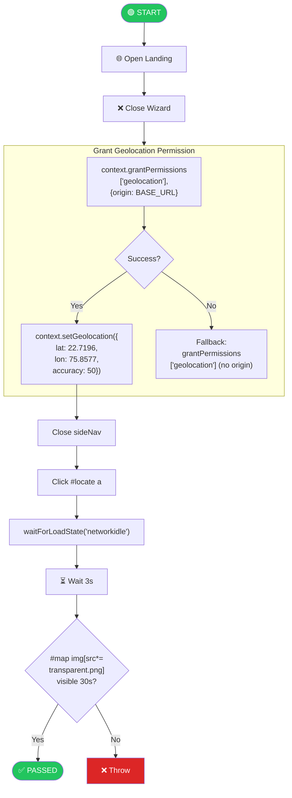

---

### Test 18: Hover Locationer

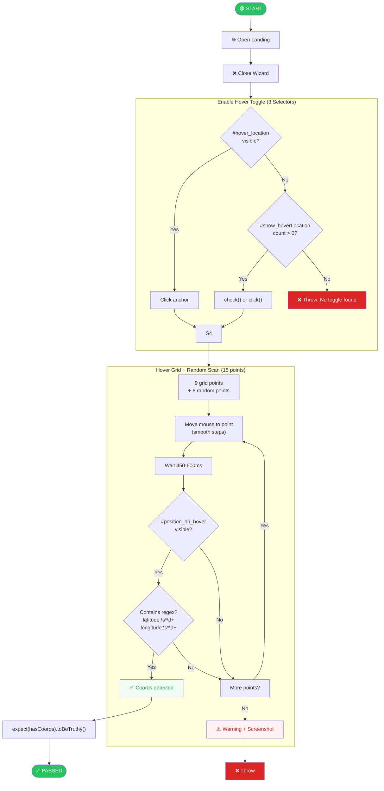

---

### Test 19: AOI View & World View

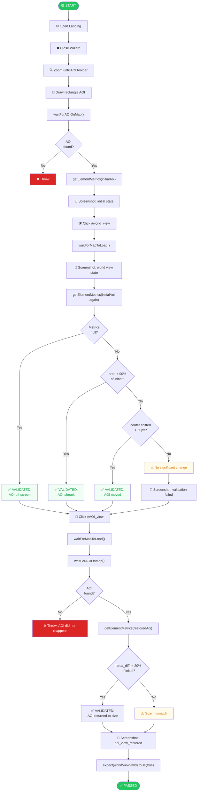

**Area Comparison Formula:**

```
initial.area = 11706
threshold = 11706 × 0.2 = 2341

restored.area = 11706
|11706 - 11706| = 0
0 < 2341 → ✅ SIMILAR

━━━━━━━━━━━━━━━━━━━━━━━━━━━
initial.area = 11706
restored.area = 5000
|11706 - 5000| = 6706
6706 > 2341 → ⚠️ MISMATCH
━━━━━━━━━━━━━━━━━━━━━━━━━━━
```

---

### Test 20: AOI Info Window

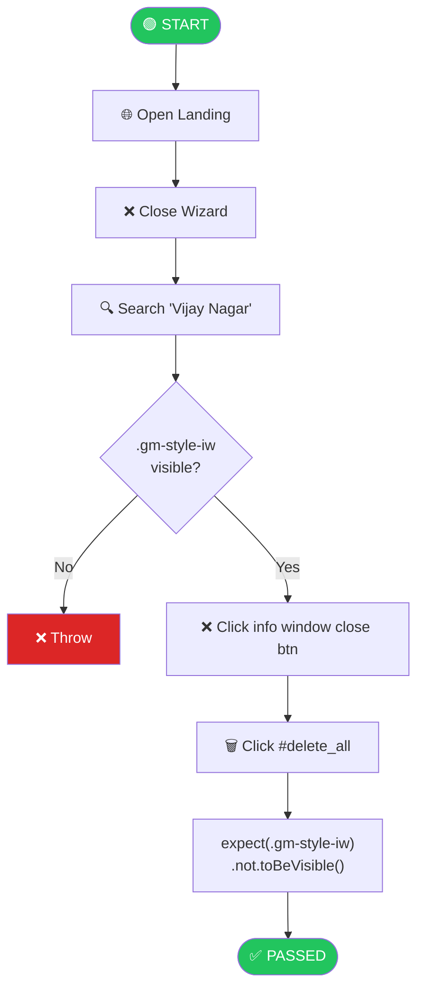

---

## 💾 Diagnostics System

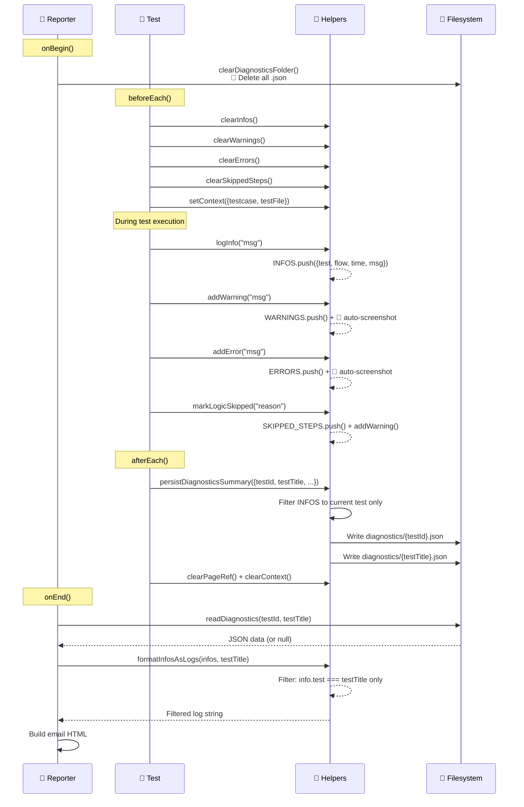

**Diagnostic File Lookup Strategy:**

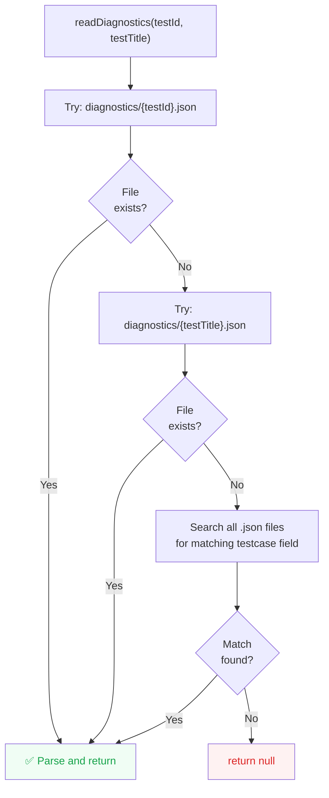

---

## 📧 Email Reporting

CI sends email from the single `email-report` aggregation job after every shard
has completed. Shard jobs never send email directly, so recipients receive at
most two messages per run:

- **Daily summary:** one message containing totals for all 68 tests: passed,
    failed, warnings, skipped logic, and skipped tests.
- **Failure report:** one message sent only when one or more tests remain failed
    after retries. It contains the consolidated results, per-test logs, errors,
    warnings, skipped steps, screenshots, and videos collected from every shard.

The report job uses the merged Playwright blob reports plus downloaded
diagnostics. Configure `DAILY_REPORT_EMAILS` and `FAILURE_ALERT_EMAILS` as
GitHub Actions secrets; do not put SMTP credentials in the repository.

```mermaid
flowchart LR
    subgraph INPUT["Input Data"]
        A[68 Test Results]
        B[68 Diagnostic JSONs when generated]
        C[Screenshots + Videos]
    end

    INPUT --> BUILD

    subgraph BUILD["Build Emails"]
        D[Sort by<br/>test order]
        E[Filter logs<br/>per test]
        F[Collect<br/>attachments<br/>max 20MB]
    end

    BUILD --> EMAIL1
    BUILD --> EMAIL2

    subgraph EMAIL1["📊 Daily Summary"]
        G1[🖼️ Logo]
        G2[🕐 Time + ⏱️ Duration]
        G3[✅❌⚠️⏭️ Stats + Progress]
        G4[🟢/🔴/🟡/🟣 Summary badge]
        G5[🌍 Footer]
    end

    subgraph EMAIL2["📋 Failure Report (only when failures remain)"]
        H1[All of Daily Summary]
        H2[📋 Test Results Table]
        H3[Per-row:<br/>💥 Error pre<br/>⚠️ Warnings<br/>⏭️ Skipped steps<br/>📋 Scrollable logs]
        H4[📎 Attachments]
    end

    EMAIL1 --> SMTP["📧 One daily email"]
    EMAIL2 --> SMTP2["📧 One consolidated failure email"]
```

**Attachment Decision Per Test:**

```mermaid
flowchart TD
    START{Test result} --> PASS{PASSED +<br/>no warnings<br/>no skips?}
    PASS -->|Yes| CLEAN["— clean —<br/>No attachments"]
    PASS -->|No| COLLECT
    COLLECT["Collect attachments"] --> IMG["🖼️ .png/.jpg from<br/>result.attachments"]
    COLLECT --> VID["🎬 .webm/.mp4 from<br/>result.attachments"]
    IMG --> SIZE
    VID --> SIZE
    SIZE{"Total size<br/>< 20MB?"}
    SIZE -->|No| SKIP["⚠️ Skip (too large)"]
    SIZE -->|Yes| ATTACH["📎 Add to email"]
    SKIP --> ATTACH

    style CLEAN fill:#f1f5f9,color:#94a3b8
    style ATTACH fill:#f0fdf4,color:#16a34a
    style SKIP fill:#fffbeb,color:#d97706
```

---

## 🔄 CI/CD Pipeline

```mermaid
flowchart TD
    TRIGGER["⏰ Cron: 06:30 UTC<br/>= 12:00 IST<br/>OR Manual dispatch"] --> CHECKOUT
    CHECKOUT["📥 Checkout@v4"] --> NODE
    NODE["🟢 Setup Node.js 22"] --> NPMCI
    NPMCI["📦 npm ci"] --> PWINSTALL
    PWINSTALL["🎭 npx playwright<br/>install --with-deps"] --> RUN

    subgraph RUN["🧪 Run Tests (8 shards × 4 workers)"]
        ENV["🌍 Environment Variables<br/>BASE_URL, SMTP_*, HEADLESS=true<br/>PAUSE_MULTIPLIER=0.3, CI=true"]
        CMD["npx playwright test<br/>8 shards, 4 workers each, retries=2"]
    end

    RUN --> ART1
    RUN --> ART2
    RUN --> ART3

    ART1["📊 Upload blob + HTML reports<br/>7 days retain"]
    ART2["📸 Upload test-results/<br/>7 days retain"]
    ART3["💾 Upload diagnostics/<br/>7 days retain"]

    style TRIGGER fill:#8b5cf6,color:#fff
    style ART1 fill:#eff6ff,color:#2563eb
    style ART2 fill:#fff7ed,color:#ea580c
    style ART3 fill:#f0fdf4,color:#16a34a
```

**CI vs Local Differences:**

| Setting | 💻 Local | 🔄 CI |
|---------|----------|-------|
| `HEADLESS` | `false` | `true` |
| `PAUSE_MULTIPLIER` | `0.55` | `0.3` ⚡ |
| `retries` | `0` | `2` (CI=true) |
| `workflow timeout` | N/A | `60 min per shard` ⏰ |
| Email | Optional local reporter | One daily summary + one failure report |
| Artifacts | ❌ | ✅ (7 days) |

---

## ⚙️ Configuration Reference

| Variable | Required | Default | Description |
|----------|----------|---------|-------------|
| `BASE_URL` | ✅ | `https://datastore.geowgs84.com` | Target URL |
| `HEADLESS` | ❌ | `false` | Headless mode |
| `PAUSE_MULTIPLIER` | ❌ | `0.55` | Visual pause speed |
| `SOFT_ASSERT` | ❌ | `false` | Warnings instead of errors |
| `DEFAULT_WAIT` | ❌ | `15000` | Default timeout (ms) |
| `OUTLINE_WAIT_MS` | ❌ | `90000` | Outline wait (ms) |
| `PREVIEW_WAIT_MS` | ❌ | `90000` | Preview wait (ms) |
| `DETAILS_IMAGE_WAIT_MS` | ❌ | `120000` | Detail image wait (ms) |
| `REPORT_TIMEZONE` | ❌ | `Asia/Kolkata` | Email timezone |
| `SMTP_HOST` | ✅* | — | SMTP host |
| `SMTP_PORT` | ✅* | `587` | SMTP port |
| `SMTP_USER` | ✅* | — | SMTP user |
| `SMTP_PASS` | ✅* | — | SMTP password |
| `DAILY_REPORT_EMAILS` | ✅* | — | Summary recipients |
| `FAILURE_ALERT_EMAILS` | ✅* | — | Detailed recipients |

---

## 🔍 Troubleshooting

```mermaid
flowchart TD
    ERROR["❌ Test Failure"] --> TYPE{Error Type?}

    TYPE -->|"ReferenceError:<br/>clearInfos not defined"| F1["Fix: Add clearInfos<br/>to import in common.js"]
    TYPE -->|"ReferenceError:<br/>CURRENT_TESTFILE"| F2["Fix: Use CURRENT_TEST_FILE<br/>(with underscore)"]
    TYPE -->|"Wrong test's logs<br/>in email"| F3["Fix: clearInfos() in<br/>beforeEach + filter in<br/>persistDiagnosticsSummary"]
    TYPE -->|"Log box wraps<br/>long paths"| F4["Fix: white-space:pre<br/>+ overflow-x:auto<br/>+ max-width:820px"]
    TYPE -->|"No diagnostics found"| F5["Fix: persistDiagnostics<br/>crashed before write<br/>check for ReferenceErrors"]
    TYPE -->|"Preview not found<br/>for 21AT products"| F6["Expected: dashed sceneId<br/>handled by _findImageBySceneId<br/>split on '-' and '_'"]
    TYPE -->|"Scenes table empty"| F7["Normal: no scenes for AOI<br/>Test returns 'empty'<br/>⏭️ SKIPPED in email"]
    TYPE -->|"Upload modal won't open"| F8["3-strategy fallback<br/>1. Click → 2. Retry → 3. JS eval"]

    style F1 fill:#fef2f2,color:#dc2626
    style F2 fill:#fef2f2,color:#dc2626
    style F3 fill:#fef2f2,color:#dc2626
    style F4 fill:#fffbeb,color:#d97706
    style F5 fill:#fffbeb,color:#d97706
    style F6 fill:#f0f9ff,color:#2563eb
    style F7 fill:#f0f9ff,color:#2563eb
    style F8 fill:#f0f9ff,color:#2563eb
```

**Debug Commands:**

```bash
# Check diagnostics folder
ls -la diagnostics/

# View specific diagnostic
cat diagnostics/*QuickBird*.json | jq '.warnings, .errors, .skippedSteps'

# Run single test with visible browser
HEADLESS=false PAUSE_MULTIPLIER=1 npx playwright test -g "Shopping Cart"

# Run only P0 tests
npx playwright test -g "\[P0\]"

# Run without email
DAILY_REPORT_EMAILS= FAILURE_ALERT_EMAILS= npx playwright test

# Check artifact sizes
du -sh test-results/ diagnostics/
```

---

## 🏁 Quick Start

```bash
git clone <repo> && cd Geowgs84-Datastore
npm ci
cp .env.example .env   # Edit with BASE_URL, SMTP, emails
npx playwright test
npx playwright show-report
```

---

<p align="center">
  
  <br/><br/>
    <sub>🤖 Automated E2E · Playwright · Node.js 22 · 8 Shards × 4 Workers · Daily CI</sub>
</p>
